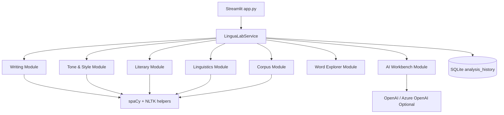

# LinguaLab

LinguaLab is a lightweight Streamlit demo for language intelligence workflows across writing analytics, tone/style, literary analysis, linguistics, corpus exploration, word study, and AI-assisted rewriting.

## Features

- **Writing Analytics**: readability, vocabulary richness, grammar hints, sentence complexity, passive voice estimate
- **Tone and Style Analysis**: formality score, sentiment, emotional tone, audience suitability
- **Literary Analysis**: literary devices, theme extraction, character co-occurrence mapping, narrative structure summary
- **Linguistics Lab**: morphology tags, syntax tagging, pseudo-dependency trees, IPA-like transcription, etymology hints
- **Corpus Analysis**: multi-document comparison, n-grams, topic buckets, keyword extraction, lexical diversity metrics
- **Word Explorer**: definitions, synonyms, semantic relationships, examples, historical language notes
- **AI Language Workbench**: summarisation, simplification, tone transformation, rewriting, translation comparison
- **SQLite history**: persists module runs for quick recall in the UI

## Architecture



## Project Structure

- `/app.py` Streamlit entrypoint and responsive UI
- `/linguolab/` modular analysis package
  - `services.py` orchestration layer
  - `db.py` SQLite persistence
  - `openai_client.py` OpenAI/Azure OpenAI integration
  - `modules/` domain modules
- `/tests/` unit tests
- `/.github/workflows/ci.yml` GitHub Actions CI

## Setup

```bash
pip install -r requirements.txt
streamlit run app.py
```

## Configuration

Environment variables:

- `LINGUALAB_DB_PATH` (default: `lingualab.db`)
- `LINGUALAB_AI_PROVIDER` (`auto`, `openai`, or `azure`; default: `auto`)
- `OPENAI_API_KEY`
- `OPENAI_MODEL` (default: `gpt-4o-mini`)
- `AZURE_OPENAI_ENDPOINT`
- `AZURE_OPENAI_API_KEY`
- `AZURE_OPENAI_API_VERSION` (default: `2024-02-01`)
- `AZURE_OPENAI_DEPLOYMENT`

If OpenAI/Azure credentials are missing, AI Workbench uses a local low-cost demo transform.

## Testing

```bash
pytest -q
```

## CI/CD

GitHub Actions workflow (`.github/workflows/ci.yml`) runs tests on push and pull request.

## Deployment Instructions

### Streamlit Community Cloud
1. Push repository to GitHub.
2. Create a new Streamlit Cloud app pointing to `app.py`.
3. Add secrets/environment variables for OpenAI or Azure OpenAI (optional).
4. Deploy.

### Self-hosted
1. Install Python 3.11+.
2. Install dependencies with `pip install -r requirements.txt`.
3. Run with `streamlit run app.py --server.port 8501`.
4. Reverse-proxy with Nginx or Caddy if needed.
